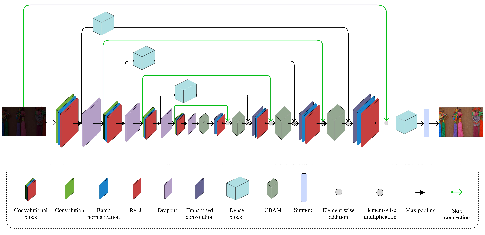
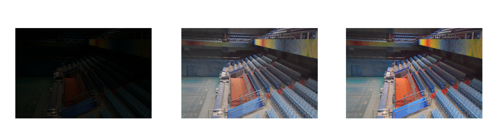

# CDAN: Convolutional Dense Attention-guided Network for Low-light Image Enhancement


<p align="justify">
Low-light image enhancement is the task of restoring photographs captured in poor illumination so they become visually usable and useful for downstream computer-vision systems. Images taken in dim scenes typically suffer from low signal-to-noise ratio, crushed shadows, muted or shifted colors, and loss of fine texture — problems that break face recognition, object detection, and even simple human interpretation. Traditional approaches (histogram equalization, Retinex-based decompositions, and handcrafted denoising) can improve brightness or local contrast but often introduce artifacts, color casts, or over-amplified noise when faced with real, complex lighting conditions.

In recent years, deep learning has become the dominant paradigm for this problem because neural networks can learn end-to-end mappings from dark images to high-quality enhanced images.

This project implements and experiments with a Convolutional Dense Attention Network (CDAN) — an architecture designed specifically for low-light image enhancement that combines four core ideas:

- Convolutional feature extraction (encoder/decoder): hierarchical convolutional blocks capture edges, textures, and local contrast at multiple scales.

- Dense connectivity (Dense blocks): inspired by DenseNet, layers are densely connected so later layers can directly reuse earlier feature maps. This increases feature reuse, reduces the need to relearn redundant representations, and improves gradient propagation during training.

- Attention mechanisms: spatial and/or channel attention modules let the network emphasize underexposed regions, useful color cues, or regions with important fine detail while suppressing noise and irrelevant background information. Attention helps the model allocate capacity where it matters most for perceptual quality.

- Skip connections & autoencoder design: skip links between encoder and decoder preserve high-frequency details and help the decoder reconstruct textures and edges that would otherwise be smoothed out by deep downsampling.
</p>
  
<p class="row" float="left" align="middle">

</p>
<p align="center"><b>Figure 1:</b> High-level overview of the CDAN model.</p>

## Experimental Results

In this section, I present the experimental results obtained by training the CDAN model using the LOw-Light ([LOL](https://www.kaggle.com/datasets/soumikrakshit/lol-dataset)) dataset.


### Quantitative Evaluation
| PSNR ↑ | SSIM ↑ | LPIPS ↓ |
|-------------|-------------|--------------|
| 29.472 dB     | 0.868       | 0.070        |


### Qualitative Evaluation
<p class="row" float="left" align="middle">

</p>
<p align="center"><b>Figure 2:</b> Output of the CDAN model on the LOL dataset.</p>


## Getting Started

To get started with the CDAN project, follow these steps:

### 1. Clone the Repository

You can clone the repository using Git. Open your terminal and run the following command:

```bash
git clone https://github.com/danielluca00/Low-Light-Image-Enhancement.git
```
### 2. Configure Settings
<p align="justify">
After cloning, navigate to the project directory and locate the `config/default.json` file. This file contains all the configuration settings for the CDAN model, including model architecture, training parameters, and dataset paths. You can customize these settings according to your requirements.
</p>

Key configuration settings:
- **Model Settings**: Define the model architecture and its parameters
- **Training Settings**:
  - `device`: Training device (cuda/mps/cpu)
  - `n_epoch`: Number of training epochs
  - `lr`: Learning rate
  - Dataset paths and dataloader configurations
- **Testing Settings**:
  - Dataset paths and configurations
  - Post-processing options
  - Output paths for generated images

Modify these settings according to your setup, particularly:
1. Update the dataset paths to point to your data
2. Adjust the training parameters if needed
3. Configure the output paths for saved models and results

### 3. Install Dependencies

You can install project dependencies using pip:
```bash
pip install -r requirements.txt
```

### 4. Run the Project

You are now ready to run the CDAN project. To start the training, use the following command:

```bash
python run.py -p train -c config/default.json
```

To test the trained model, run:
```bash
python run.py -p test -c config/default.json
```

## Experimental setup
The following hardware and software were used for training the model:
- GPU: NVIDIA GeForce RTX 4090
- RAM: 24 GB SSD
- Operating System: Ubuntu 22.04.1 LTS
- Python version: 3.10.18
- PyTorch version: 2.6.0
- PyTorch CUDA version: 11.8

